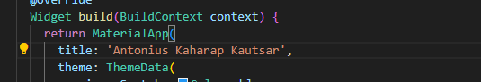
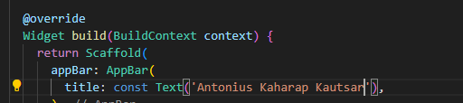
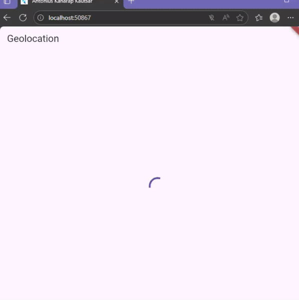
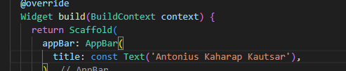
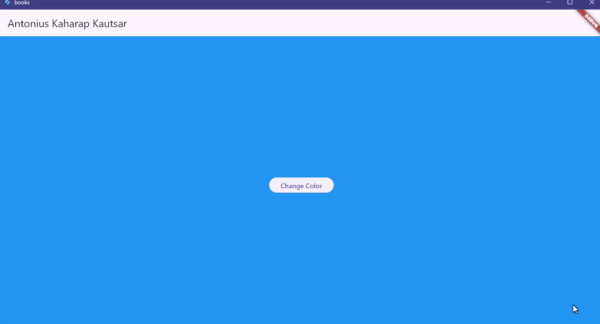

# Practicum 1 Task

1. Tambahkan nama panggilan Anda pada title app sebagai identitas hasil pekerjaan Anda.
2. Carilah judul buku favorit Anda di Google Books, lalu ganti ID buku pada variabel path di kode tersebut. Caranya ambil di URL browser Anda seperti gambar berikut ini.
Kemudian cobalah akses di browser URI tersebut dengan lengkap seperti ini. Jika menampilkan data JSON, maka Anda telah berhasil. Lakukan capture milik Anda dan tulis di README pada laporan praktikum. Lalu lakukan commit dengan pesan "W11: Soal 2".
3. Jelaskan maksud kode langkah 5 tersebut terkait substring dan catchError!
Capture hasil praktikum Anda berupa GIF dan lampirkan di README. Lalu lakukan commit dengan pesan "W11: Soal 3".

# Answer for practicum 1

1. 

2. 

3. 

The substring part takes only a selected portion of the full string so the output shows just that slice. The catchError part handles any error that occurs in the Future so the app does not crash and can show an error message instead.

# Practicum 2 Task

1. Jelaskan maksud kode langkah 1 dan 2 tersebut!
Capture hasil praktikum Anda berupa GIF dan lampirkan di README. Lalu lakukan commit dengan pesan "W11: Soal 4".

# Answer for practicum 2

1. 

Step 1 shows how to create several asynchronous functions that wait for three seconds before returning a number. These functions show that async code does not block the main UI thread while waiting. Each function uses Future.delayed to simulate a slow process.

Step 2 shows how the count function waits for each async function to finish one by one using await. It adds all returned values together, then updates the result on the screen using setState. This step shows how to gather results from multiple async tasks in sequence and then refresh the UI with the final value.

# Practicum 3 Task

1. Jelaskan maksud kode langkah 2 tersebut!
Capture hasil praktikum Anda berupa GIF dan lampirkan di README. Lalu lakukan commit dengan pesan "W11: Soal 5".
2. Jelaskan maksud perbedaan kode langkah 2 dengan langkah 5-6 tersebut!
Capture hasil praktikum Anda berupa GIF dan lampirkan di README. Lalu lakukan commit dengan pesan "W11: Soal 6".

# Answer for practicum 3

1. 

In step 2 the code adds a method called getNumber() that returns a Future and uses a Completer. Inside getNumber() it creates the completer, calls another async method calculate() and returns completer.future. The calculate() method waits (delays) and then calls completer.complete(42). This means: we’re manually controlling when the Future finishes; the Future will complete only when we call completer.complete(...). This gives us more control over asynchronous behaviour than simply returning a value directly.

2. 

In step 2 the code uses a Completer and async/await mechanism: you call getNumber() which returns a Future, then inside that Future you wait and then manually complete the operation. In steps 5-6 instead the code uses the .then(...).catchError(...) pattern on getNumber(), so rather than using await inside an async method, the code attaches callbacks (then for success, catchError for error) to the Future. Essentially the difference is: step 2 uses the newer async/await plus manual completion via Completer, making flow more readable/structured; steps 5-6 revert to a callback-style with then and catchError to handle success and error of the Future.

# Practicum 4 Task

1. Capture hasil praktikum Anda berupa GIF dan lampirkan di README. Lalu lakukan commit dengan pesan "W11: Soal 7".
2. Jelaskan maksud perbedaan kode langkah 1 dan 4!

# Answer for practicum 4

1. 

In step 1 the code likely shows a simple synchronous or basic asynchronous call where one Future is awaited and then the result is used. In step 4 the code introduces parallel execution of multiple Futures (or non-sequential calls) so that multiple tasks run at the same time (rather than one after the other), improving efficiency and reducing total wait time.

2. The key difference is how the Futures are executed: in step 1 they are handled sequentially — you wait for one to finish before starting the next. In step 4 they are executed concurrently or in parallel — you launch multiple Futures at once and then await all of them (for example using Future.wait()), so the total waiting time is shorter because tasks overlap.

# Practicum 5 Task

1. Capture hasil praktikum Anda berupa GIF dan lampirkan di README. Lalu lakukan commit dengan pesan "W11: Soal 9".
2. Panggil method handleError() tersebut di ElevatedButton, lalu run. Apa hasilnya? Jelaskan perbedaan kode langkah 1 dan 4!

# Answer for practicum 5

1. 

2. The difference between code in step 1 and step 4 is: in step 1 you trigger the async function and handle the result only in the normal (success) path (using then or await), whereas in step 4 you explicitly add an error-handling path (using .catchError(...) or a try/catch) so you deal with failures too. Step 4 is safer, because it handles both success and error; step 1 handles only the success scenario.

# Practicum 6 Task

1. Tambahkan nama panggilan Anda pada tiap properti title sebagai identitas pekerjaan Anda.
2. Jika Anda tidak melihat animasi loading tampil, kemungkinan itu berjalan sangat cepat. Tambahkan delay pada method getPosition() dengan kode await Future.delayed(const Duration(seconds: 3));
Apakah Anda mendapatkan koordinat GPS ketika run di browser? Mengapa demikian?
Capture hasil praktikum Anda berupa GIF dan lampirkan di README. Lalu lakukan commit dengan pesan "W11: Soal 12".

# Answer for practicum 6

1. 

2. 

In phone:

GIF result (on web since i dont have a screen recorder that lets me do gif): 

Yes, the loading animation appears after adding the delay. When running in the browser we do not get real GPS coordinates because the browser cannot access the device’s native location services and the Geolocator plugin relies only on the browser’s limited web geolocation API, which does not provide actual device GPS data on localhost.

# Practicum 7 Task

1. Apakah ada perbedaan UI dengan praktikum sebelumnya? Mengapa demikian?

2. Apakah ada perbedaan UI dengan langkah sebelumnya? Mengapa demikian?

# Answer for practicum 7

1. 

Yes our UI is different from the previous practicum. We are now using a FutureBuilder which the material states is a more efficient clean and reactive way for our UI to work with future data.

2.  

Yes our UI is different from the previous step. This is because we added specific code to handle errors. Our UI will now show a text message if an error happens which it did not do before.

# Practicum 8 Task

1. Tambahkan nama panggilan Anda pada tiap properti title sebagai identitas pekerjaan Anda.
Silakan ganti dengan warna tema favorit Anda.
2. Cobalah klik setiap button, apa yang terjadi ? Mengapa demikian ?
Gantilah 3 warna pada langkah 5 dengan warna favorit Anda!
Capture hasil praktikum Anda berupa GIF dan lampirkan di README. Lalu lakukan commit dengan pesan "W11: Soal 16".

# Answer for practicum 8

1.  

2. 

When we click the 'Change Color' button on the first screen, we navigate to the second screen. This happens because the button calls our _navigateAndGetColor method which uses Navigator.push to show the NavigationSecond screen.

When we click any of the color buttons (Red, Green, or Blue) on the second screen, we go back to the first screen, and the first screen's background changes to that specific color. This happens because those buttons use Navigator.pop to return to the previous screen and pass the chosen color back as a result. Our _navigateAndGetColor method was waiting for this result with await and then uses setState to update the background color.

# Practicum 9 Task

1. Cobalah klik setiap button, apa yang terjadi ? Mengapa demikian ?
Gantilah 3 warna pada langkah 3 dengan warna favorit Anda!
Capture hasil praktikum Anda berupa GIF dan lampirkan di README. Lalu lakukan commit dengan pesan "W11: Soal 17".

# Answer for practicum 9

1. 

When we click the 'Change Color' button, it calls our _showColorDialog method. This method uses await showDialog to open an alert box with the title "Very important question". When we click a color button like 'Red' or 'Green', its onPressed function updates our color variable to that new color and then closes the dialog. After the dialog is closed, the await finishes and the setState function is called. This tells the screen to rebuild, and our Scaffold's background color is updated to the new color we just selected.